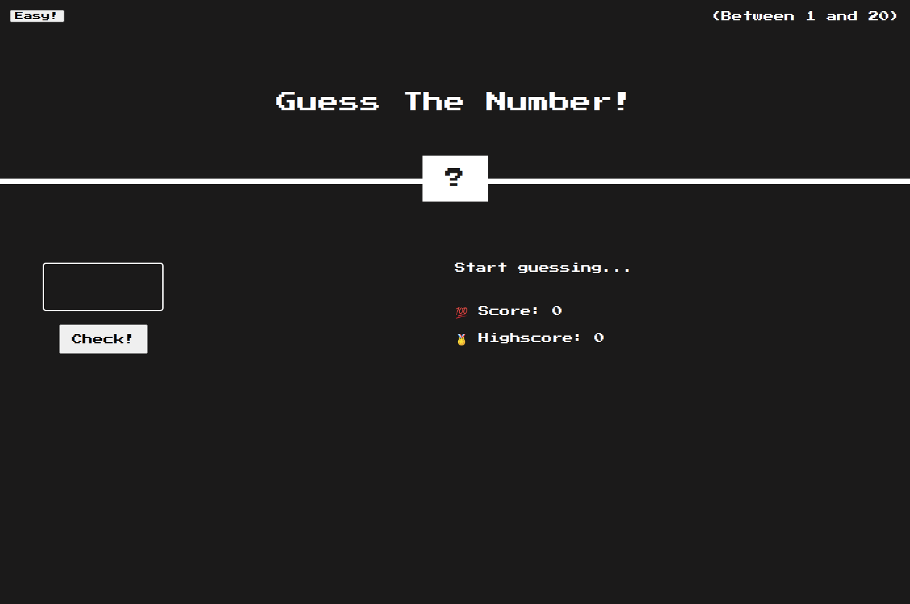

# Guess The Number
Guess the number is a simple guiessing game with a lovely retro design. 

  [Play game](https://loretta-arineva.github.io/guess-the-number/)

  
## About
### Objective
Guess the number.

### How to play
The game has two modes - Easy and Hard.
* **Easy Mode** - Guess a number between 1 and 20
* **Hard Mode** - Guess a number between 1 and 50

1. Enter a number between the stated values. For *mobile* this is located below the mode button and for *desktop* it is in the upper right corner.
2. Check if you have guessed correctly
    * In case you guessed correctly. 
        1. The screen will turn green and there will be a message saying "Correct!" 
        2. The mystery box will reveal the number. 
        3. The hint will say "Yes!"
        4. You will get the option to play again.
    * In case you guessed incorrectly
        1. You will get a hint that will tell you wether your number was too high or too low
        2. Try again
3. Scores
    1. *Score* indicates the number of attempts that you have made.
    2. Highscore indicates the least number of attemts that you took to guess the number correctly.

## Author
Made with love by Loreta Krasteva 
~I hope you enjoy the game!